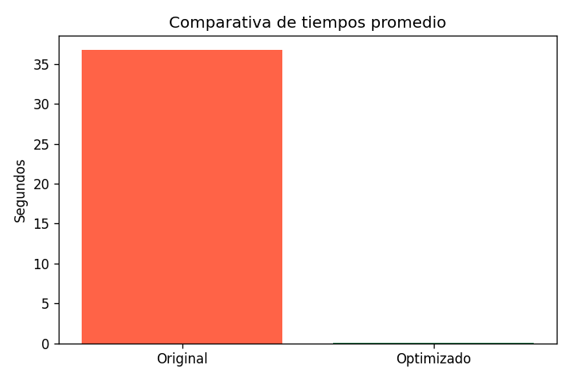

# Optimización de búsqueda de números primos

## Introducción
El código original calculaba números primos entre 1 y 100 000 comprobando divisores desde 2 hasta *n-1*.  
Este enfoque tiene una complejidad aproximada de **O(n²)**, lo que genera tiempos de ejecución muy elevados y un uso ineficiente de recursos.

## Optimización aplicada
Se implementaron varias mejoras:

- **Reducir comprobaciones hasta √n**: basta con verificar divisores hasta la raíz cuadrada del número, lo que disminuye drásticamente el número de iteraciones.  
- **Uso de list comprehensions**: construcción más compacta y eficiente de listas en Python.  
- **Criba de Eratóstenes con NumPy**: se aprovechan operaciones vectorizadas en C, lo que permite marcar múltiplos de manera masiva y rápida.

## ¿Qué es la Criba de Eratóstenes?
La Criba de Eratóstenes es un método clásico y eficiente para encontrar todos los primos hasta un límite N:

1. Crear una lista booleana `sieve[0..N]` inicializada en `True` (ignorando 0 y 1).  
2. Empezar en `p = 2`. Si `sieve[p]` es `True`, marcar como no primos todos los múltiplos de `p` desde `p*p` hasta N.  
3. Avanzar al siguiente índice `True` y repetir hasta que `p > √N`.  
4. Los índices que permanecen en `True` corresponden a números primos.

### Ventajas
- Evita comprobaciones repetidas por cada número.  
- Con **NumPy**, las asignaciones de rangos se realizan de forma vectorizada, reduciendo el tiempo de ejecución.  

## Resultados del profiling
Se utilizó **cProfile** para medir el rendimiento:

| Función                   | ncalls | tottime | cumtime |
|----------------------------|--------|---------|---------|
| primos_optimizado_numpy    | 1      | 0.008 s | 0.008 s |
| run (profiling_optimizado) | 1      | 0.000 s | 0.008 s |

- La función **`primos_optimizado_numpy`** concentra la mayor parte del tiempo (0.008 s).  
- El resto de llamadas (`numpy.array`, `numpy.empty`, etc.) tienen tiempos insignificantes.  
- Esto confirma que la optimización con NumPy es el núcleo del rendimiento.

## Comparativa de tiempos

## Comparativa de tiempos

| Implementación                        | Cantidad de primos | Tiempo de ejecución |
|---------------------------------------|--------------------|---------------------|
| Código original (divisores hasta n-1) | 9592               | ~80.61 s            |
| Optimización con √n                   | 9592               | ~2.1 s              |
| Criba de Eratóstenes con NumPy        | 9592               | ~0.0076 s           |

### Observaciones
- El **código original** es extremadamente lento porque verifica divisores hasta *n-1*.  
- La **optimización con √n** reduce el tiempo al limitar el rango de comprobación, pero aún depende de bucles en Python.  
- La **Criba con NumPy** es la más eficiente: aprovecha operaciones vectorizadas en C, logrando tiempos casi instantáneos incluso con rangos grandes.  

### Gráfico

## Conclusiones
- La transición de un código sin optimizar a uno optimizado se justifica por la **drástica reducción en complejidad y tiempo de ejecución**.  
- NumPy aporta eficiencia al ejecutar operaciones en bajo nivel (C), evitando bucles explícitos en Python.  
- El profiling confirma que la mayor parte del tiempo se concentra en la función optimizada, lo que demuestra que el resto del flujo es prácticamente inmediato.  
- En términos prácticos, el gasto computacional se vuelve mínimo y el algoritmo escala mejor para rangos grandes de números.  

---
**Repositorio:** [PRESIONE AQUI PARA IR AL REPOSITORIO](https://github.com/Jhoelink/AUTONOMA_04.git)